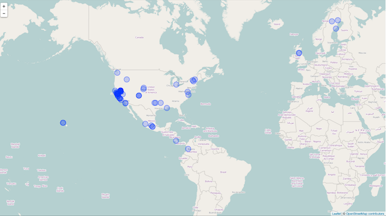

## SPOCC

SPecies OCCurrence data

- Access data from a variety of sources
- Use a single seamless interface
- Integrate with spatial data


## Data sources

Data comes from six major sources.

- [GBIF][gbif] 
- [Vertnet][vertnet] 
- [BISON][bison] 
- [iNaturalist][inat] 
- [Berkeley ecoengine][ecoengine]
- [AntWeb][antweb]
- [eBird][ebird]

[gbif]: https://github.com/ropensci/rgbif
[vertnet]: https://github.com/ropensci/rvertnet
[bison]: https://github.com/ropensci/rbison
[inat]: https://github.com/ropensci/rinat
[taxize]: https://github.com/ropensci/taxize
[ecoengine]: https://github.com/ropensci/ecoengine
[antweb]: http://antweb.org/
[ebird]: http://ebird.org/content/ebird/

## Searches
Basics of searching
```{r load_library, message=FALSE,warning=FALSE,echo=FALSE}
library(spocc)
library(rWBclimate)
library(taxize)
```


```{r Searching}
out <- occ(query='Accipiter striatus', from='gbif', limit = 10)
out$gbif

```

## Multiple sources
You can also search multiple sources and get a standard result
```{r multi_search}
ebirdopts = list(region='US'); gbifopts = list(country='US')
out <- occ(query='Setophaga caerulescens', from=c('gbif','bison',
'inat','ebird'), gbifopts=gbifopts, ebirdopts=ebirdopts)
out <- occ2df(out)
head(out,5)
```

## Mapping with multiple map engines

Mapping with google maps
```{r google_maps,warning=FALSE,message=FALSE }
sal_map_dat <- occ(query = 'Ambystoma maculatum', from = 'gbif', 
gbifopts = list(country="US",hasCoordinate=TRUE), limit = 50)
mapggplot(sal_map_dat)

```

## Maps in base R

You can make quick plots in base R

```{r base_maps}
spnames <- c('Accipiter striatus', 'Setophaga caerulescens', 
'Spinus tristis')
out <- occ(query=spnames, from='gbif', 
gbifopts=list(hasCoordinate=TRUE))
plot(out, cex=1, pch=10)

```

## Javascript maps

You can even make nice javascript maps using leaflet

```{r leaflet,eval=FALSE}
spp <- c('Danaus plexippus','Accipiter striatus','Pinus contorta')
dat <- occ(query = spp, from = 'gbif', gbifopts = 
list(hasCoordinate=TRUE))
data <- occ2df(dat)
mapleaflet(data = data, dest = ".")

```



## And more

We'll also cover integration with other ropensci packages that draw on taxonomic sources, and other spatial data.

